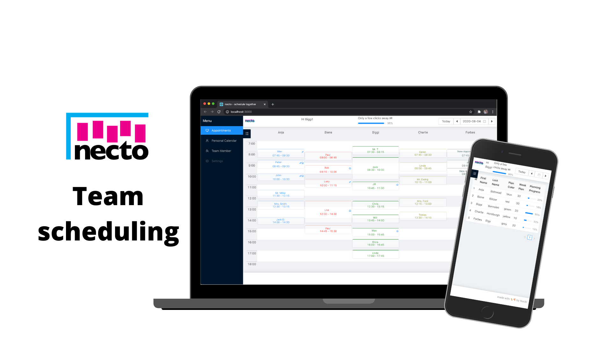

# necto

📅 Appointment scheduling for teams in a health care environment

necto provides teams with the ability to schedule appointments with patients/clients on a weekly basis. The number of weekly appointment a team member has to fulfill can be indivdually defined. Every Appointment can be defined as in House or as a home visit.

## Project description

App to keep track of the appointments of a team of therapists, where each appointment has a defined frequency (i.e. weekly) and a number of recurrences (i.e. 10 times). The App provides an overview of appointments for the hole team, as well as personal views for each team member. Single appointments can be moved to different dates/times/therapists without necessarily affecting the rest of the recurring appointments.

## Features
### personal calendar

Every User (if associated to an employee) has a personal calendar to view / edit their appointments.

### team calendar

The team calendar shows a daily overview of all appointment of the selected team.

### occupied rooms

individual implementation

### person lists
searchable Lists of distinct person groups with view / edit functionality
- patients
- patients waiting list (roughly spoken all patients without current appointments)
- doctors

### institutions

### settings

- employee settings
- user settings
- user roles
  - employee
  - planner
  - admin

- introduce clients / patients dataset + tie to appointments
  - waiting list for new clients / patients

## Getting started

### setting up a development environment

1. clone the repo

`git clone https://github.com/hucki/necto.git`

2. install the dependencies

`npm install`

3. setup a postgres Database

4. setup `/server/.env` file (see `/server/.env.example`)

to get started set `NODE_ENV=development` and use the .env Variables prefixed with `DEV_DB_[...]` for your DB

5. start necto

`npm start`

6. enjoy scheduling 📅!

### dockerize app

1. create a `docker-compose.yml` from `docker-compose.yml.example`
2. if you are starting with an empty db: seed the database with the script from `prisma/seed.ts`
3. use `docker-compose up` to build and serve the app locally

## Tech stack

### Front End:

- [React](https://reactjs.org)
- [React Redux](https://react-redux.js.org/)
- [React Query](https://github.com/tannerlinsley/react-query)
- [TypeScript](https://www.typescriptlang.org)
- [Day.js](https://day.js.org)
- [Chakra UI](https://chakra-ui.com/)

### Back End:

- [Node.js](https://nodejs.org/)
- [Express](https://expressjs.com)
- [TypeScript](https://www.typescriptlang.org)
- [Prisma ORM](https://www.prisma.io/)
- [PostgreSQL](https://www.postgresql.org)

## Authentication

- [express session]()
- [redis]()
- [passport local]()

## Future Plans

- [ ] embed local holidays: [date-holidays](https://www.npmjs.com/package/date-holidays)
- [ ] time tracking and statistics for team members

## Contributors

[Stefan Huckschlag](https://github.com/hucki)

## License

MIT © [Stefan Huckschlag](https://github.com/hucki)
